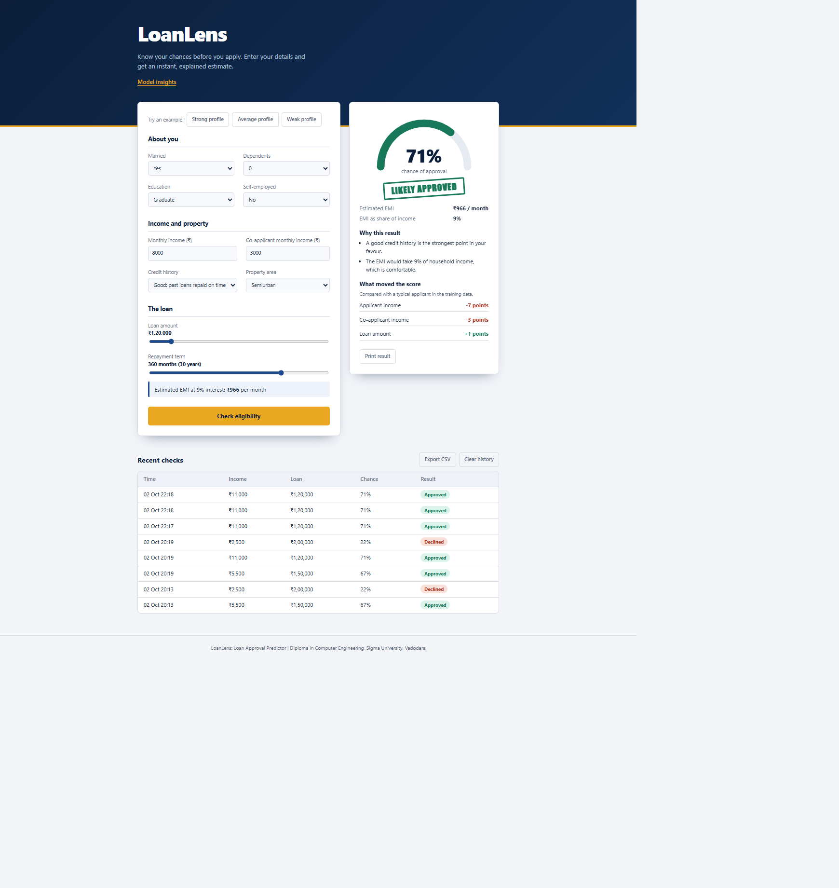
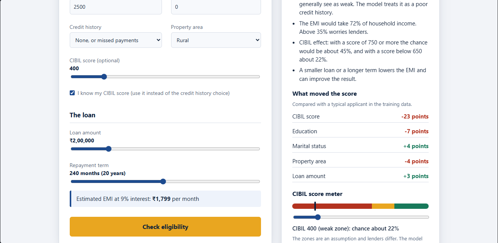
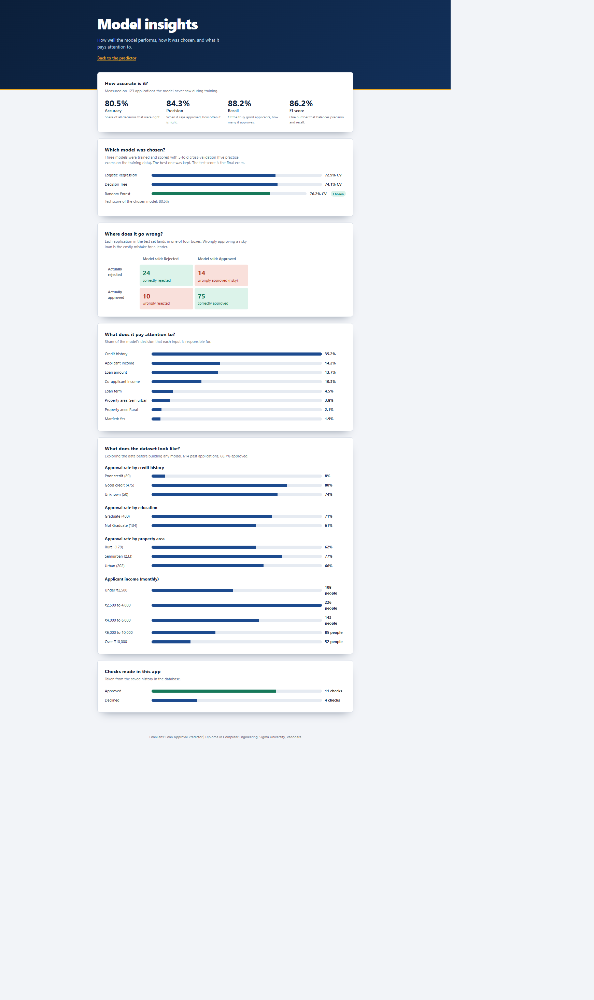

# LoanLens: Loan Approval Predictor

LoanLens is a web app that estimates the chance of a loan being approved and explains the result in plain language. It was built as a Diploma in Computer Engineering project at Sigma University, Vadodara.

## What it does

You enter an applicant's details (income, loan amount, credit history and so on). The app shows a live approval gauge, a confidence band, the monthly EMI, the main factors behind the result, and a suggestion for a smaller loan that would be approved. You can also enter an optional CIBIL score and see a CIBIL meter. Every check is saved in a local database.

## Screenshots







## Tech stack

- **Backend:** Python, Flask
- **Machine learning:** scikit-learn (Logistic Regression, Decision Tree, Random Forest), pandas, joblib
- **Database:** SQLite
- **Frontend:** plain HTML, CSS and JavaScript (no external libraries, works offline on localhost)

## Features

- Live approval gauge with confidence bands: Likely (70% and above), Borderline (45 to 69%), Unlikely
- Sliders for loan amount and term, with a live EMI estimate (assumes 9% interest)
- "What moved the score": shows which inputs pushed the result up or down
- What-if suggestion: finds a smaller loan that the model would approve
- Optional CIBIL score (300 to 900) with a CIBIL meter under the result: drag it to see the chance in the weak, borderline and good zones
- Warning when the inputs are outside the range of the training data
- Example profile buttons (strong, average, weak)
- Print the result, view recent checks, clear history, export history as CSV
- Model insights page: accuracy, model comparison, confusion matrix, feature importance, dataset charts, app usage
- Input validation on the server

## CIBIL score layer (an assumption)

The dataset has no CIBIL scores, so the model cannot learn how a CIBIL score changes the chance. Instead, an optional score is turned into the credit-history input the model does know:

| CIBIL zone | What the app does |
|---|---|
| Below 650 (weak) | Treated as a poor credit history |
| 650 to 749 (borderline) | Average of the poor-credit and good-credit results |
| 750 and above (good) | Treated as a good credit history |

These zones are an assumption, and real lenders' cut-offs differ. The CIBIL layer is a rule added on top of the model. It is not part of the accuracy figures below, and the model was not retrained. If the box "I know my CIBIL score" is not ticked, the app uses the credit history choice as before.

## How the model was chosen

Three models are trained on the same data and compared using 5-fold cross-validation. The best one is kept and then measured once on test data it has never seen. All three use `class_weight="balanced"` so the model pays extra attention to rejected loans, which are the rarer class.

| Model | Cross-validation accuracy |
|---|---|
| Logistic Regression | 72.9% |
| Decision Tree | 74.1% |
| Random Forest (chosen) | 76.2% |

Results of the chosen model on 123 unseen test applications:

| Accuracy | Precision | Recall | F1 score |
|---|---|---|---|
| 80.5% | 84.3% | 88.2% | 86.2% |

Confusion matrix: 24 correctly rejected, 14 wrongly approved, 10 wrongly rejected, 75 correctly approved. The most important factor is credit history.

## Dataset

The Kaggle "Loan Prediction Problem Dataset" (training file), 614 applications, saved as `data/loan_data.csv`. The Gender and Loan_ID columns are not used; gender is excluded on purpose for fairness. Blank values are filled automatically by the training pipeline.

Units: monthly income in rupees, loan amount in thousands of rupees, loan term in months.

## How to run (Windows, VS Code terminal)

Tested with Python 3.13. Run the commands one at a time.

First time only:

```
python -m venv venv
venv\Scripts\activate
pip install -r requirements.txt
```

Every time:

```
venv\Scripts\activate
python train_model.py
python app.py
```

Then open http://127.0.0.1:5000 in your browser. Press Ctrl + C in the terminal to stop the server.

## Project structure

```
loanlens/
├── app.py              Flask server: validates input, predicts, applies the CIBIL rule, saves to the database
├── train_model.py      trains and compares the models, saves the best one
├── generate_data.py    makes practice data only if the real dataset is missing
├── requirements.txt    Python libraries needed (versions pinned)
├── data/
│   └── loan_data.csv   the dataset
├── docs/
│   └── screenshots/    pictures used in this README
├── templates/
│   ├── index.html      main predictor page
│   └── insights.html   model insights page
└── static/
    ├── style.css       styling
    ├── app.js          main page behaviour, CIBIL slider and meter
    └── insights.js     insights page charts
```

Created when you run the project: `model.joblib`, `metrics.json`, `baseline.json` (by `train_model.py`) and `loan.db` (by `app.py`).

## Limitations

- The dataset is small (614 rows), so the results are only a rough guide.
- The model still wrongly approves 14 risky applications out of 123 test cases.
- The EMI uses a fixed 9% interest rate.
- The "what moved the score" explanation changes one input at a time, so it is approximate.
- The CIBIL zones are an assumption, because the dataset has no CIBIL scores.
- Real banks use many more rules and data; this is an educational estimate, not a lending decision.